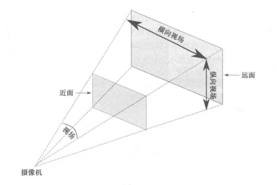
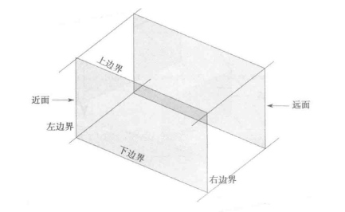

learning-threejs
================

Code repository for the examples from the Packt book "Learning Threejs"

THREE.Scene 和 方块, 球体等对象都继承自 THREE.Object3D

geometries 几何图形

Orthographic 正交

创建面向摄像机的面, 顺时针

创建一个网格需要一个几何体, 以及多个材质

* Scene
  * add
  * remove
  * children
  * getObjectByName
  * name
  * traverse
  * overrideMaterial 强制场景中的所有物体使用相同的材质
* Fog 雾化效果
* FogExp2
* SceneUtils
  * createMultiMaterialObject 多种材质创建网格
* MeshLambertMaterial 一种用于无光泽表面的材料，没有镜面高光。
<!-- * WireframeHelper 线框帮助类 -->
* Mesh
  * position
    * 直接设置坐标
  * rotation
  * scale
  * translateX
  * translateY
  * translateZ
  * visible
* PerspectiveCamera
  * fov 视场
  * aspect 长宽比
  * near 近面距离
  * far 远面距离
  * zoom 变焦
  * lookat
* OrthographicCamera
  * left
  * right
  * top
  * bottom
  * near
  * far
  * zoom
  * lookat

